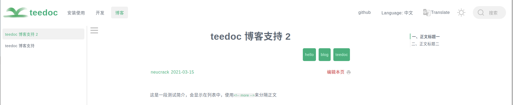
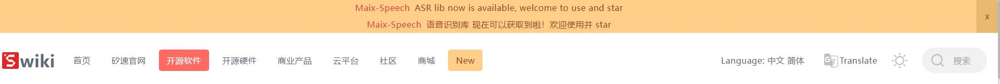

## `teedoc-plugin-markdown-parser`: default markdown parsing plugin

Configure the plugin in `site_config.json`
```json
    "plugins": {
        "teedoc-plugin-markdown-parser":{
            "from": "pypi",
            "config": {
                "parse_files": ["md"],
                "mermaid": true,
                "mermaid_use_cdn": false,
                "mermaid_cdn_url": "https://cdn.jsdelivr.net/npm/mermaid/dist/mermaid.min.js",
                "mathjax": {
                    "enable": true,
                    "file_name": "tex-mml-chtml",
                    "config": {
                        "loader": {
                            "load": ["output/svg"]
                        },
                        "tex": {
                            "inlineMath": [["$", "$"], ["\\(", "\\)"]]
                        },
                        "svg": {
                            "fontCache": "global"
                        }
                    }
                }
            }
        }
    }
```

* `parse_files`: File formats involved in parsing
* `mermaid`: Enable mermaid plugin
* `mermaid_use_cdn`: Use CDN for mermaid
* `mermaid_cdn_url`: CDN url for mermaid, only used when `mermaid_use_cdn` is `true`
* `mathjax`: Mathematical formula rendering support
   * `enable`: Whether to enable
   * `file_name`: `js` file name, which defines the default functions, the default is `tex-mml-chtml`, [reference here](http://docs.mathjax.org/en/latest/web/components/ index.html)
   * `config`: `mathjax` configuration, [mathjax](https://www.mathjax.org/) configuration, see [here](http://docs.mathjax.org/en/latest for specific configuration items /web/configuration.html)

## `teedoc-plugin-jupyter-notebook-parser`: jupyter notebook parsing plugin

Configure the plugin in `site_config.json`
```json
    "plugins": {
        "teedoc-plugin-jupyter-notebook-parser":{
            "from": "pypi",
            "config": {
            }
        }
    }
```

## `teedoc-plugin-search`: Website search plugin

Let the website and documents support the search function, support the searched current document and the whole site search

To use, add to the `plugins` keyword in `site_config.json`:
```json
"plugins": {
    "teedoc-plugin-search":{
        "from": "pypi",
        "config": {
            "search_hint": "Search",
            "env": {
                "main_color": "#4caf7d",
                "main_color_dark": "#1b4c33",
                "hint_shadow_color": "rgba(76, 175, 125, 0.38)"
            }
        }
    }
}
```


The prompt content of different documents can be configured in the corresponding document `config.json` to facilitate multi-language support (internationalization/i18n). Of course, the plugin supports `Chinese`, `English` and `Japanese` by default, the translation is [here](https://github.com/teedoc/teedoc/tree/main/plugins/teedoc-plugin-search/teedoc_plugin_search/locales), when it is not found by default, `English` will be used. Manually setting the following variables will overwrite the translation that comes with the plug-in

The supported configurations are as follows:

```json
"teedoc-plugin-search":{
    "config": {
        "search_hint": "Search",
        "input_hint": "Enter keywords, separate multiple keywords with spaces",
        "loading_hint": "Loading, please wait...",
        "download_err_hint": "Failed to download the file, please refresh and try again or check the network",
        "other_docs_result_hint": "Results from other documents",
        "curr_doc_result_hint": "Current document search result"
    }
}
```

* `search_hint`: the prompt message of the search box (button), the default is `Search`
* `input_hint`: input hint information in the search box of the search page, default `Keywords separated by space`
* `loading_hint`: Load the file prompt for searching, the default is `Loading, wait please ...`
* `download_err_hint`: The download of the file required for the search fails, the user needs to refresh the browser to try again or the network environment cannot download the file, the default is `Download error, please check network and refresh again`
* `other_docs_result_hint`: search result hint, search result in other documents, default `Result from other docs`
* `curr_doc_result_hint`: search result hint, the search result in the currently browsed document, default `Result from current doc`
* `env`: Replace some colors, including
   * `main_color`: main color, default `"#4caf7d"`
   * `main_color_dark`: main color of black theme, default `"#1b4c33"`
   * `hint_shadow_color`: shadow color, default `rgba(76, 175, 125, 0.38)`

## `teedoc-plugin-baidu-tongji`: Baidu Analytics

Add the code of [Baidu Analytics](https://tongji.baidu.com/) on each page, send the visit information to Baidu, and you can see the visit statistics in the background

After registering and logging in to Baidu Statistics, add a website on the management page, and then there will be a code acquisition page with the following code
```js
<script>
var _hmt = _hmt || [];
(function() {
  var hm = document.createElement("script");
  hm.src = "https://hm.baidu.com/hm.js?90c693aa2************c14a50bb49";
  var s = document.getElementsByTagName("script")[0];
  s.parentNode.insertBefore(hm, s);
})();
</script>
```

Here is a string of keys `90c693aa2************c14a50bb49`, copy this string of keys, and then add to the `plugins` keyword in `site_config.json`:
```json
"plugins": {
    "teedoc-plugin-baidu-tongji":{
        "from": "pypi",
        "config": {
            "code": "Fill in the access key here"
        }
    }
}
```

After the website is deployed, you can see the visit information on the real-time visitor page of the Baidu statistics background


## `teedoc-plugin-google-analytics`: Google Analytics

Add the code of [Google Analytics](https://analytics.google.com/) on each page, send the visit information to Google, and you can see the visit statistics in the background

After registering and logging in to Google Analytics, add a website on the management page, and then there will be an `ID` starting with `UA-` or `G-`, such as `UA-123456789-1` or `G-AABBCCDDJJOOKK`

Then add in the `plugins` keyword in `site_config.json`:
```json
"plugins": {
     "teedoc-plugin-google-analytics":{
         "from": "pypi",
         "config": {
             "id": "Fill in the resource ID here"
         }
     }
}
```

## `teedoc-plugin-comments-gitalk`: gitalk comment plugin

[gitalk](https://github.com/gitalk/gitalk) is a comment tool based on the `github` `issue` question and answer system. Using `gitalk`, you don’t need to build your own server, you only need to register a `github` account , All the data will be put on the `issue` of a repository of `github`.

> If you encounter a problem, [here](https://github.com/gitalk/gitalk/wiki/Q&A) may have the answer you want

### Config github

Go to [github developers settings](https://github.com/settings/developers),
* Add one Oauth Apps
* Then generate secrets, we got client ID and secrets
* Fill in `Homepage URL` with url, e.g. `https://teedoc.github.io`
* Fill in `Authorization callback URL` with `https://teedoc.github.io/`


### Config doc

To use it, you need to add a plug-in in the `site_config` file
```json
    "teedoc-plugin-gitalk": {
        "from": "pypi",
        "config": {
            "contrainer": "comments-container",
            "env": {
                "clientID": "********",
                "clientSecret": "********",
                "repo": "repo name",
                "owner": "orgnization name or user name",
                "admin": ["user names have write access"]
            }
        }
    }
```

* `contrainer`: The container tag `id` that contains the comments, the default is `comments-container`, the document page and blog page in the `teedoc-plugin-theme-default` plugin contain this tag
* `env`: `gitalk` js plugin configuration items, see [here](https://github.com/gitalk/gitalk#options) for more parameters.
  * `clientID` and `clientSecret`: You need to create a new application in [github application](https://github.com/settings/applications/new) to get `ID` and `Secret`
  * `repo` and `owner`: are the name and owner of the repository, for example, [github.com/teedoc/teedoc.github.io](https://github.com/teedoc/teedoc.github.io) is used here `issue` as a comment system, just fill in `teedoc.github.io` and `teedoc`
  * `admin`: is the name of the user who has write access to this repository
  * `adminAutoCreate`: Automatically create issue when first time administrator visit page or not
  * `main_color`: the main appearance color of comments, optional
  * `second_color`: the secondary appearance color of comments, optional


~~**To open a comment on each page, the administrator needs to log in to `gitalk` to access the page, `gitalk` will automatically create an issue, and add the label `Gitalk` and the label `url path`, (the path characters are `50` characters in length limit).** Of course, there are also methods for batch creation, which are not introduced here, and you can explore it yourself.~~ Now issue can be created automatically


You can also manually create `issue` and specify the label `Gitalk` of `issue` (the first letter is capitalized), and then add another label `page url path` or `custom id` (the label is custom `id` then Need to set the page `id` on the page using this `issue`)

In addition to setting the `env` parameter in `site_config`, it can also be set in the article's `metadata`. Add a `gitalk-` prefix in front of the setting. For example, to set the `title` of the `issue` generated by `gitalk`, just You can set `gitalk-title`. Here are a few examples:

* If you create an issue manually, you can specify the issue for a page, and specify the issue number in the metadata for the article

```markdown
---
title: *****
gitalk-number: 2
---
```

* Or create an issue manually first, specify the use of the specific label issue on the page, you can take a look at [official example](https://github.com/gitalk/gitalk/issues/1)


```markdown
---
title: *****
id: Demo
---
```

or

```markdown
---
title: *****
gitalk-id: Demo
---
```

## `teedoc-plugin-assets`: assets add plugin

You can freely add resources to the page through this plug-in, such as `css` and `js` resource files

For example, the path mapping of resource files has been added, and there are two files `/static/css/custom.css` and `/static/css/custom.js`, which need to be added to the head and tail of the page respectively.
At the same time, I also hope to add a `meta` tag to the head

`site_config.json`:

```json
{
    "route": {
            "assets": {
                "/static/": "static",
            },
        },
    "plugins": {
        "teedoc-plugin-assets":{
            "from": "pypi",
            "config": {
                "header_items": [
                    "/static/css/custom.css",
                    "<meta name=\"plugin-assets\" content=\"example meta item\">"
                ],
                "footer_items": [
                    "/static/css/custom.js"
                ],
                "env":{
                    "main_color": "#000000"
                }
            }
        },
    }
}
```
For `css` and `js` files, you can write `url` directly like this, or you can write a link at the beginning of `http`.

Here the variables in `env` will be replaced in the resource file, and used in the resource file by `${variable name}`

`custom.css`:

```css
a {
    color: ${main_color}
}
```


## `teedoc-plugin-google-translate`: Google page translation plugin

The function is the same as that of the right mouse button of `Chrome` to translate this page

Before translation:



After translation:


```json
"config": {
    "lang": "auto",
    "doc_types": ["page", "doc", "blog"],
    "domain": "/"
}
```

* `lang`: The language of the page that needs to be translated. By default, it is not recommended to set it, or set it to the same `locale` of the document. For example, if `locale` is `zh_CN`, this can be set to `zh-CN `
* `doc_types`: Which types of document pages should be displayed, 0 to 3 of `["page", "doc", "blog"]`,
* `domain`: From which URL to download the source code of `google translate`, the default is `"/"`, which means to download from this website, it can also be set to `translate.google.com` or `translate.google.cn`
> Mainly considering that some files cannot be downloaded without a proxy in China, it is actually necessary to request `translate.googleapis.com`. When making the plug-in, I found that even if it is set to `translate.google.cn`, there is a ` The js` file requested a `cleardot.gif` file under the domain name of `google.com`, which caused the network request to be stuck for a long time until it timed out to load the translation, so the `js` file (`element_main.js`) was modified and Put it locally so that it can be accessed quickly.
> But this is also risky. Because the code and the code of the `Google` server are separated, in case `Google` updates the code one day, we also need to update it manually (although it will not change with a high probability), then welcome to update and modify. Submit PR


## `teedoc-plugin-ad-hint`: Global tips for advertisements or important news

Effect:



use:

Add plugin in `site_config`

```json
"plugins": {
     "teedoc-plugin-ad-hint": {
         "from": "pypi",
         "config": {
             "type": "hint",
             "label": "☆",
             "content": "content",
             "show_after_s": 432000
         }
     }
}
```

Configuration: The default configuration code is [here](https://github.com/teedoc/teedoc/blob/e909be61546e3817b872bd5005b9b867c6843e60/plugins/teedoc-plugin-ad-hint/teedoc_plugin_ad_hint/__init__.py#L22)

* `type`: default `"hint"`, currently only supports `hint`
* `label`: By default `"New"`, a label will be automatically added to the navigation bar, click to display the top prompt content, here set the content displayed by the label
* `content`: default `""`, content, the content of the `hint` category will be displayed at the top
* `show_times`: default `2`, set how many times the user visits the page, the prompt will not be displayed automatically, if the value is `<= 0`, it will always be displayed
* `show_after_s`: default `432000`, set the time to be automatically displayed next time, the unit is seconds, the default is `5` days
* `date`: default `null`, hint message's update date time, if hint content is updated, set this to make hint auto show, format:`2021-11-07 14:23:00`, if date set `>` now time, the hint will always auto show
* `color`: default `"#a0421d"`, font color
* `link_color`: default `"#e53935"`, link (`<a>` tag) font color
* `link_bg_color`: default `"#e6ae5c"`, link (`<a>` tag) background color
* `bg_color`: default `"#ffcf89"`, background color
* `color_hover`: default `"white"`, the font color when hovering the mouse
* `bg_color_hover`: default `"#f57c00"`, the background color when the mouse is hovering
* `close_color`: default `"#eab971"`, close button background color

### i18n

If the document has multiple languages, you can configure the plugin in `site_config`:
```json
"plugins": {
     "teedoc-plugin-ad-hint": {
         "from": "pypi",
         "config": {
             "type": "hint",
             "label": "☆",
             "content": "content",
             "show_after_s": 432000
         }
     }
}
```

Then overwrite the settings in the document `config` in different languages
```json
"plugins": {
     "teedoc-plugin-ad-hint": {
         "config": {
             "label": "🦀",
             "content": "Content, support html syntax, do not use English single quotes",
         }
     }
}
```

Try to use the same `config` template file for documents in the same language. In the specific document `config`, `import` makes it easier to configure


## `teedoc-plugin-thumbs-up`: thumbs up plugin

With this plugin, you can display the like button on the page, and you can count the number of likes. The effect is as follows


### Basic usage

Add the plugin in `site_config`:
```json
"plugins": {
    "teedoc-plugin-thumbs-up": {
        "from": "pypi",
        "config": {
            "url": "https://xxxx.xxxx.com:80",
            "show_up_count": true,
            "show_down_count": false
        }
    }
}
```

It should be noted that because the web page is a purely static page, the use of this plug-in needs to be used with the server, and the statistical information is stored on the server.

The server uses the `pip install teedoc-plugin-thumbs-up` command to install the plugin and then use the `teedoc-thumbs-up-server` command to run the service. You can use the `--port` parameter to specify the port, and more parameters use `teedoc' -thumbs-up-server --help`View
> It is recommended to proxy this service with a proxy server such as nginx.
> In addition, if your website is https protocol, then this service also needs to be https service, you can apply for a free certificate and configure it with nginx

It should be noted that this service is just a simple routine and does not fully guarantee the security of the service. It is recommended to read the server code carefully to modify and customize your own server script. Code: [teedoc-plugin-thumbs-up/server](https ://github.com/teedoc/teedoc/tree/main/plugins/teedoc-plugin-thumbs-up/server)

### i18n

Like other plugins, override the settings in the document `config` in different languages. For parameters, see [Plugin Source Default Configuration](https://github.com/teedoc/teedoc/blob/a8b93a4f29330b018c2e38589786b33d00854309/plugins/teedoc-plugin-thumbs- up/teedoc_plugin_thumbs_up/__init__.py#L24)
```json
"plugins": {
    "teedoc-plugin-thumbs-up": {
        "config": {
            "label_up": "Helpful",
            "label_down": "Not helpful",
            "msg_already_voted": "You have already voted",
            "msg_thanks": "Thanks for your feedback",
            "msg_down_prompt": "Thanks for the feedback, please tell us where we can improve? (minimum 10 words)",
            "msg_down_prompt_error": "Message requires a minimum of 10 words and a maximum of 256 words",
            "msg_error": "There was an error requesting the server!"
        }
    }
}
```

