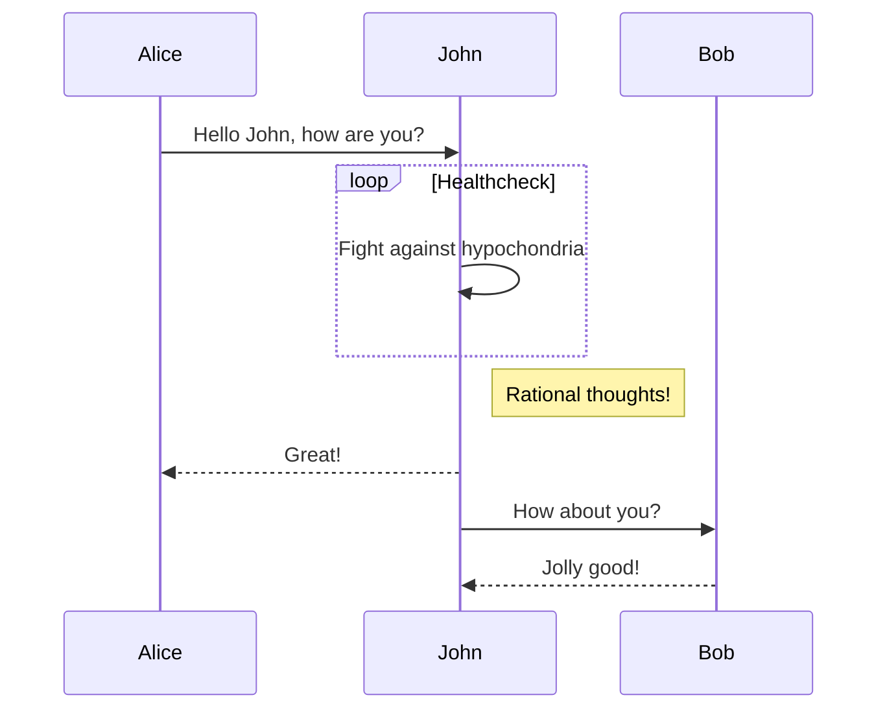

> This article is a document written using `Markdown`, using the page effect generated by `teedoc`, the source code of `Markdown` file can be found [here](https://github.com/teedoc/teedoc.github.io/blob/main/docs/get_started/en/syntax/syntax_markdown.md)

## Markdown using brief

The file placed under the document directory, if it is a recognized file, such as `*.md`, it will be converted to `*.html`, if it is not recognized, such as `*.jpg`, it will be copied intact into the output folder (`out`).

The default `Markdown` parsing is done by the plugin `teedoc-plugin-markdown-parser`, which is used by default in the template project.

If you need to link the documentation to the left directory, configure it in `sidebar.json` or `sidebar.yaml`.

If you have used `Markdown`, it is also highly recommended to spend 2 minutes browsing it!


## Markdown basic content format

You need to confirm that a `markdown` parser plugin is enabled in `site_config.json`, such as `teedoc-plugin-markdown-parser`.

Create a folder or file in the directory corresponding to `config.json`, such as `get_started/zh/syntax/syntax_markdown.md` (`README.md` will eventually generate `index.html`), pay attention to use `UTF- 8` file encoding (do not use `Windows` default Notepad), it is recommended to use [vscode](https://code.visualstudio.com/) + `Markdown Preview Enhanced` plugin, the default file will be `UTF-8 `Encoding, if not, you can also click the encoding in the lower right corner and click the pop-up option `Save with encoding` and select `UTF-8` to change the encoding.


### Markdown metadata header

Each `md` file can add a header, also called `metadata` (metadata in Chinese). The article information is set through these key values, and the format is `yaml` format. Of course, this file header is optional, or you can Do not write

```markdown
---
title: markdown syntax
tags: teedoc, markdown, syntax
keywords: teedoc, markdown, syntax
desc: teedoc's markdown syntax introduction and examples
id: zh_readme
class: zh_readme
# Start with a # sign to indicate a comment
---
```

* `title`: the title of the article, can be used if there is no metadata header
```markdown
# Article title
```
or
```markdown
article title
===
```

* `keywords`: Keywords, multiple keywords separated by commas `,` will be added to the `html` header, which is convenient for search engines to crawl, and will not be displayed on the page. Can also be written in `yaml` list format
```markdown
keywords:
  - teedoc
  - markdown
  - grammar
```
* `desc`: The page description will be added to the `html` header and will not be displayed on the page, which is convenient for search engines to crawl
* `tags`: article tags, which will be displayed on the page. Multiple tags are separated by commas `,`, or they can be written in the format of `yaml` list, same as `keywords`
* `id`: The `id` of the page, which will be added to the `html` tag, such as `<html id="zh_readme">...</html>`, usually not needed, usually in a single page for a certain page It may be used when customizing `css` alone, it will override the settings in `config.json`
* `class`: page `class`, separated by commas `,`, can not be set, it will override the settings in `config.json`. For example, you can set the `css` style of a specific page by setting this value. For specific supported styles, see [theme plugin documentation](../plugins/themes.md)
* `layout`: The layout template used by the page. By default, the configuration in the theme plugin will be used. If you need to customize the layout of this page, you can set this parameter. The path is relative to the path set by `layout_root_dir` in `site_config`, `layout_root_dir` defaults to `layout`, so to use `layout/special_layout.html` just fill in `special_layout.html`. For layout template syntax see [layout documentation](../usage/layout_template.md)
* `date`: the last update date, the format is `2022-09-15`
  * If not set: The last modification time of the file will be used by default. If it is a `git` repository, it will automatically get the time of the last commit of the page from `git`. The system reads the last modified time (this is most likely inaccurate). In addition, if `update` is filled with a value, the latest modification date in `update` will be used
  * If you don't want to show the last modified date, disable it by setting the value to `false`
  * If the `update` value is set, the value in `date` will still be used first
* `update`: update history, an update history table will be generated at the beginning of the article, format:
```markdown
update:
  - date: 2022-09-15
    author: author1
    version: 1.1.0
    content: updated xxx
  - date: 2022-08-05
    author: author2
    version: 1.0.0
    content: updated xxx
```
* `update_open`: display update history or not, default `true`, set to `false` will collapse update history(supported by theme plugin)

### Markdown content

The content is written in `Markdown` syntax, because the main title will be converted into a `<h1>` tag, so it is recommended to start with the second-level title in the content. Such a page has only one `<h1>` tag, which is convenient for search engines to crawl take, such as

```markdown
---
title: teedoc
---

## Title one

content. . .

## title two

content. . .
```

## title

### Level 3 heading

#### Level 4 heading

#### Level 4 Heading 2

#### Level 4 Heading 3

##### Level 5 heading

###### Level 6 heading

### Title custom id {#custom-id}
Here the custom `id` is `custom-id`

Up to level 6 headings

.. details::Markdown source code, click to expand
    ```markdown
    ### Level 3 heading

    #### Level 4 heading

    #### Level 4 Heading 2

    #### Level 4 Heading 3

    ##### Level 5 heading

    ###### Level 6 heading

    ### Title custom id {#custom-id}
    Here the custom `id` is `custom-id`
    ```

## emphasis, italics, strikethrough

We only know that **Earth** has the environment for humans to live, and ~~Mars~~, and maybe *other planets*.

.. details::Markdown source code, click to expand
    ```markdown
    We only know that **Earth** has the environment for humans to live, and ~~Mars~~, and maybe *other planets*.
    ```

## separator

delimiter
```markdown
---
***
```

---
***

## Link

[relative path, README.md file](../README.md): `../README.md`, will be automatically converted to `index.html`
[relative path, md file](./syntax_markdown.md): `./syntax_markdown.md`, will be converted to a link at the end of `.html` of the document
[absolute path, http file](https://storage.googleapis.com/tensorflow_docs/docs-l10n/site/en-us/tutorials/quickstart/beginner.ipynb): `https://. . . /beginner.ipynb`, the original link, will not be modified
[relative path, ipynb file](./syntax_jupyter.ipynb): `./syntax_jupyter.ipynb`, will be converted to a link at the end of `.html` of the document

.. details::Markdown source code, click to expand
   ```markdown
   [relative path, README.md file](../README.md)
   [relative path, md file](./syntax_markdown.md)
   [absolute path, http file](https://storage.googleapis.com/tensorflow_docs/docs-l10n/site/en-us/tutorials/quickstart/beginner.ipynb)
   [relative path, ipynb file](./syntax_jupyter.ipynb)
   ```

## list

List item:
* steamed stuffed bun
* Steamed bun
* Tea eggs

* aaaaaaa
  * Secondary list
  * Secondary list
  * Secondary list
    * Three-level list
    * Three-level list
*bbbbbb

.. details::Markdown source code, click to expand
    ```markdown
    List item:
    * steamed stuffed bun
    * Steamed bun
    * Tea eggs

    * aaaaaaa
      * Secondary list
      * Secondary list
      * Secondary list
        * Three-level list
        * Three-level list
    *bbbbbb
    ```

## code snippet

This is an inline code `print("hello")`, or emphasis `teedoc`
```python
print("hello")

print("world")
```

```c
#include "stdio.h"

int main()
{
    printf("hello world");
}
```

.. details::Markdown source code, click to expand
   ```markdown
        This is an inline code `print("hello")`, or emphasis `teedoc`
        ```python
          print("hello")

          print("world")
        ```

        ```c
          #include "stdio.h"

          int main()
          {
              printf("hello world");
          }
        ```
   ```

## Comment (quote block)

Below is a note
> Here is a comment (`<blockquote></blockquote>`)
> this is the second line of the comment
```python
# Here is the code snippet in the comment
print("hello")
```


> Notes
> comment nesting
> comment nesting

Use markdown syntax in block quotes

> #### The quarterly results look great!
>
> - Revenue was off the chart.
> - Profits were higher than ever.
>
> *Everything* is going according to **plan**.
> ```c
> printf("hello");
> ```

.. details::Markdown source code, click to expand
   ```markdown
        Below is a note
        > Here is a comment (`<blockquote></blockquote>`)
        > this is the second line of the comment
        ```python
        # Here is the code snippet in the comment
        print("hello")
        ```
        > Notes
        > comment nesting
        > comment nesting

        Use markdown syntax in block quotes

        > #### The quarterly results look great!
        >
        > - Revenue was off the chart.
        > - Profits were higher than ever.
        >
        > *Everything* is going according to **plan**.
        > ```c
        > printf("hello");
        > ```
   ```

## warn

The following is a warning message

>! This is a warning message (`<blockquote class="spoiler"></blockquote>`)

.. details::Markdown source code, click to expand
    ```markdown
    >! This is a warning message (`<blockquote class="spoiler"></blockquote>`)
    ```

## Emoji

The `emoji` syntax is not currently supported, but you can directly copy the emoji from the `emoji` to the document, for example:
🍊 🍇 😀 😅 😇

## superscript

H~2~O, y = x^2^

.. details::Markdown source code, click to expand
    ```markdown
    H~2~O, y = x^2^
    ```

## picture

Resource files will be copied to the output folder (`out`), so the most important thing is how to reference them in the documentation
* The easiest and recommended method
  Use relative paths:
  Resource files can be placed in the corresponding directory of the document, such as document `docs/get_started/zh`, you can create `docs/get_started/zh/assets/images/logo.png`,
  Then use relative path references in `docs/get_started/en/README.md`, i.e. ``
* Advanced method
  This situation is suitable for multiple documents referencing resources in the same folder (`url`), which is convenient for maintaining multiple documents, such as multilingual translation, or reducing `CDN` traffic consumption.
  Use resources outside the document path, configured in `site_config.json`
  ```json
  {
      "route": {
          "docs": {
              "/get_started/en/": "docs/get_started/en",
          },
          "assets": {
              "/get_started/assets/": "docs/get_started/assets"
          }
      }
  }
  ```
  This setting will copy the entire directory of `docs/get_started/assets` to `/get_started/assets`
  So just use relative path references in `docs/get_started/en/README.md`, i.e. ``


To display this image, you need to set the `route` key in `site_config.json`


.. details::Markdown source code, click to expand
    ```markdown
    
    

    
    ```

## video

Use the HTML `video` tag directly:

```html
<video src="https://****.com/***.mp4" controls="controls" preload="auto">your brower not support play video</video>
```

There is no video here, so it is blank, put in the correct video and it can be played

<video src="" controls="controls" preload="auto">your brower or site not support play video</video>


## iframe embedded web page

The code shared by the general video platform can be used directly, you can set the width and height slightly

<iframe src="//player.bilibili.com/player.html?aid=52613549&bvid=BV144411J72P&cid=92076022&page=1" scrolling="no" border="0" frameborder="no" framespacing="0" allowfullscreen=" true" style="width:43vw;height:34vw;min-width: 85%;"> </iframe>

.. details::Markdown source code, click to expand
    ```html
    <iframe src="//player.bilibili.com/player.html?aid=52613549&bvid=BV144411J72P&cid=92076022&page=1" scrolling="no" border="0" frameborder="no" framespacing="0" allowfullscreen=" true" style="width:43vw;height:34vw;min-width: 85%;"> </iframe>
    ```

## quote mark

I can cook I am proud. [^ dry rice man]

[^ Dry Rice Man]: Lao Tzu said
This will be annotated at the end of the article

.. details::Markdown source code, click to expand
    ```markdown
    I can cook I am proud. [^ dry rice man]

    [^ Dry Rice Man]: Lao Tzu said
    This will be annotated at the end of the article
    ```

## sheet

| Header 1 | *Header* 2 |
| -------- | -------- |
| `Cell 1` | [Cell 2](http://example.com) link |
| Cell 3 | **Cell 4** |

.. details::Markdown source code, click to expand
    ```markdown
    | Header 1 | *Header* 2 |
    | -------- | -------- |
    | `Cell 1` | [Cell 2](http://example.com) link |
    | Cell 3 | **Cell 4** |
    ```

## task list

- [x] Mission 1
- [x] Mission 2
- [ ] Mission 3
- [ ] Mission 4

.. details::Markdown source code, click to expand
    ```markdown
    - [x] Mission 1
    - [x] Mission 2
    - [ ] Mission 3
    - [ ] Mission 4
    ```

## Title link (in-page jump)


For example, to jump to the title [iframe embedded web page] (#iframe-embedded web page), just
```markdown
[iframe embedded web page](#iframe-embedded web page)
```

Here spaces are replaced with a minus sign `-`.
In addition, if the title can also customize the `id`, such as
```markdown
## iframe embedded web page {#iframe-embed}
```


## HTML

You can write `HTML` directly in the `md` file:

<div class="hello">
hello <br/> 
</div>

.. details::Markdown source code, click to expand
   Note that there are no blank lines
   ```html
   <div class="hello">
   hello 
   </div>
   ```


## math

Supports `tex` and `Latex` syntax, as well as `MathML` tags

two spellings,
* One is inline, wrap the equation with the `$` symbol, such as

The mass-energy equation $E=mc^2$ is familiar to everyone, right?

.. details::Markdown source code, click to expand
    ```markdown
    The mass-energy equation $E=mc^2$ is familiar to everyone, right?
    ```

* Another, block equation, wrap the equation with `$$`, such as

$$
E=mc^2
$$

.. details::Markdown source code, click to expand
    ```markdown
    $$
    E=mc^2
    $$
    ```

Other examples:
common:

When $a \ne 0$, there are two solutions to $ax^2 + bx + c = 0$ and they are
$$
x = {-b \pm \sqrt{b^2-4ac} \over 2a}.
$$

.. details::Markdown source code, click to expand
    ```markdown
    When $a \ne 0$, there are two solutions to $ax^2 + bx + c = 0$ and they are
    $$
    x = {-b \pm \sqrt{b^2-4ac} \over 2a}.
    $$
    ```

Divide by:

$$
\require{enclose}
\begin{array}{r}
                13 \\[-3pt]
4 \enclose{longdiv}{52} \\[-3pt]
     \underline{4}\phantom{2} \\[-3pt]
                12 \\[-3pt]
     \underline{12}\\0
\end{array}\\
$$

.. details::Markdown source code, click to expand
    ```markdown
    $$
    \require{enclose}
    \begin{array}{r}
                    13 \\[-3pt]
    4 \enclose{longdiv}{52} \\[-3pt]
        \underline{4}\phantom{2} \\[-3pt]
                    12 \\[-3pt]
        \underline{12}\\0
    \end{array}\\
    $$
    ```

Boxed:

$$
\bbox[#cde, 3px,border:1px solid blue]{y=x^2-1}
$$

.. details::Markdown source code, click to expand
    ```markdown
    $$
    \bbox[#cde, 3px,border:1px solid blue]{y=x^2-1}
    $$
    ```

## mermaid support

Use mermaid to draw many types of charts. For detailed syntax and support, please see [official website](https://mermaid-js.github.io/)



.. details::Markdown source code, click to expand
    ```markdown
        ```mermaid
        sequenceDiagram
          Alice->>John: Hello John, how are you?
          loop Healthcheck
              John->>John: Fight against hypochondria
          end
          Note right of John: Rational thoughts!
          John-->>Alice: Great!
          John->>Bob: How about you?
          Bob-->>John: Jolly good!
        ```
    ```
    Or directly `html`:
      ```html
      <div class="mermaid">
      sequenceDiagram
        Alice->>John: Hello John, how are you?
        loop Healthcheck
            John->>John: Fight against hypochondria
        end
        Note right of John: Rational thoughts!
        John-->>Alice: Great!
        John->>Bob: How about you?
        Bob-->>John: Jolly good!
      </div>
    ```

## Tab page (tabset) support

> Because it is not a standard Markdown syntax, currently only supported by teedoc, so choose to use it according to your needs
> Of course, generalization of the format to other parsers is also welcome

Effect:

.. tabset::tab title (optional)
    :id: tabset1

    ## Label one

    Content 1, you can use Markdown syntax
    ```kotlin
      fun main() {
          println("Hello World")
      }
    ```

    ## Label two

    Content 2, you can use Markdown syntax
    ```java
      public class Main {
          public static void main(String[] args) {
              System.out.println("Hello World");
          }
      }
    ```

When selecting a tag in a page, the corresponding tag in the tag page with the same `id` will be automatically selected, but not if the `id` is different or the `id` is not set.

.. tabset::
    :id: tabset1

    ## Label one

    Content 1, you can use Markdown syntax
    ```kotlin
      fun main() {
          println("Hello World")
      }
    ```

    ## Label two

    Content 2, you can use Markdown syntax
    ```java
      public class Main {
          public static void main(String[] args) {
              System.out.println("Hello World");
          }
      }
    ```

.. tabset::

    ## Label one

    Content 1, you can use Markdown syntax
    ```kotlin
      fun main() {
          println("Hello World")
      }
    ```

    ## Label two

    Content 2, you can use Markdown syntax
    ```java
      public class Main {
          public static void main(String[] args) {
              System.out.println("Hello World");
          }
      }
    ```

.. details::Markdown source code, click to expand
    ```markdown
    Effect:
    (note that a blank line is required here)
    .. tabset::tab title (optional)
        :id: tabset1
        (note that it must be aligned with the above tabset or more spaces)
        ## Label one

        Content 1, you can use Markdown syntax
        ```kotlin
          fun main() {
              println("Hello World")
          }
        ```

        ## Label two

        Content 2, you can use Markdown syntax
        ```java
          public class Main {
              public static void main(String[] args) {
                  System.out.println("Hello World");
              }
          }
        ```
    ```

## Details page (details) support

> Because it is not a standard Markdown syntax, currently only supported by teedoc, so choose to use it according to your needs
> Of course, generalization of the format to other parsers is also welcome

This is a `Markdown` syntax for `HTML5` `details` tags, `HTML` is written like this:
```html
<details>
  <summary>Title, click to expand</summary>
  <div class="details-content">
    <p>This is the content</p>
  </div>
</details>
```

Effect:

.. details::Title, click to expand

    Content 1, you can use Markdown syntax
    ```kotlin
      fun main() {
          println("Hello World")
      }
    ```

.. details:: title, expanded by default
    :open:true

    Content 1, you can use Markdown syntax
    ```kotlin
      fun main() {
          println("Hello World")
      }
    ```

.. details::Markdown source code, click to expand
    ```markdown
    .. details::Title, click to expand

        Content 1, you can use Markdown syntax
        ```kotlin
          fun main() {
              println("Hello World")
          }
        ```

    .. details:: title, expanded by default
        :open:true

        Content 1, you can use Markdown syntax
        ```kotlin
          fun main() {
              println("Hello World")
          }
        ```
    ```

