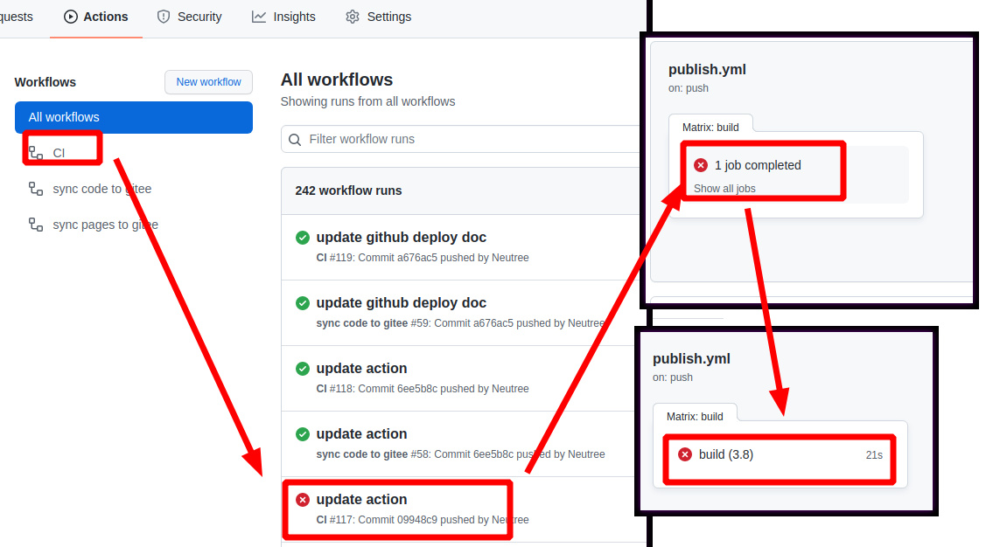
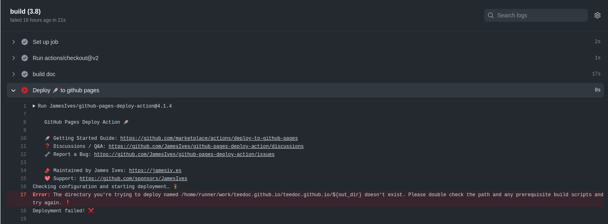
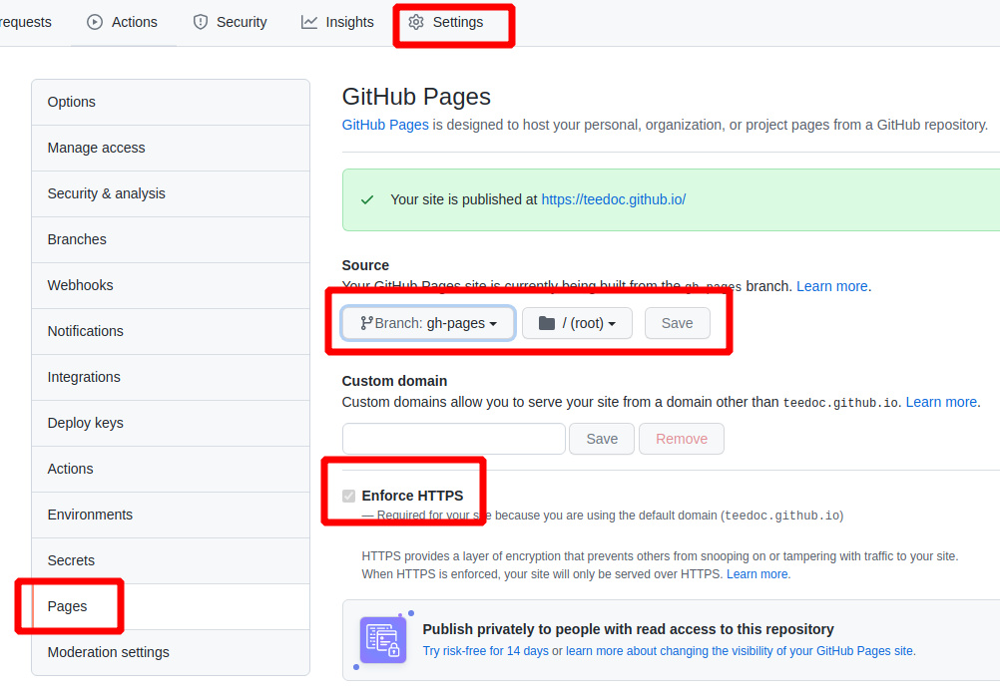

## 安装 python3

需要先安装`Python3` （仅支持 `Python3`）

比如在`Ubuntu`上：
```shell
sudo apt install python3 python3-pip git
```

`Windows` 和 `macOS`请到[官网下载](https://www.python.org/downloads/)


## 安装 teedoc

打开终端(`Windows`按`Ctrl+R`输入`cmd`)，输入：

```shell
pip3 install teedoc
```

以后使用以下命令来更新软件：
```shell
pip3 install teedoc --upgrade
```

> 如果你的网络使用 `pypi.org` 速度很慢，可以选择其它源，比如清华 tuna 源： `pip3 install teedoc -i https://pypi.tuna.tsinghua.edu.cn/simple`

现在你可以在终端使用 `teedoc` 命令了

如果不能，请检查是不是`Python`可执行目录没有加入到环境变量 `PATH`,
比如可能在 `~/.local/bin`


## 新建工程

新建一个空目录用来放文档工程

```shell
mkdir my_site
cd my_site
teedoc init
```

或者
```shell
teedoc -d my_site init
```

选择`1`，也就是`minimal`模板进行生成， 也可以直接`teedoc -d my_site --template=minimal init`进行生成

这会在 `my_site` 目录下自动生成一些基础文件


另外，除了使用`init`命令生成一份最小工程，你也可以获得一份官网文档源码，基于这个文档内容修改
```shell
git clone https://github.com/teedoc/teedoc.github.io my_site
```
或者
```shell
git clone https://gitee.com/teedoc/teedoc.gitee.io my_site
```

## 安装插件

这会根据`site_config.json`中的`plugins`的插件设置安装插件

```shell
cd my_site
teedoc install
```

> 插件也是以 `python` 包的形式发布的， 所以这会从 `pypi.org` 下载对应的插件，同样，也可以使用其它源，比如清华 tuna 源： `teedoc -i https://pypi.tuna.tsinghua.edu.cn/simple install`

## 构建 `HTML` 页面并起一个`HTTP`服务

```shell
teedoc serve
```

这个命令会先构建所有`HTML`页面以及拷贝资源文件，然后起一个`HTTP`服务
如果只需要生成页面，使用

```shell
teedoc build
```


在显示 `Starting server at 0.0.0.0:2333 ....` 后，就可以了

打开浏览器访问: [http://127.0.0.1:2333](http://127.0.0.1:2333)


同时可以看到目录下多了一个`out`目录，里面就是生成的静态网站内容，直接拷贝到服务器使用`nginx`或者`apache`进行部署即可


## 在 github 上基于模板仓库创建新仓库 并使用 pages 服务快速创建网站

使用 teedoc 官网模板, 使用 github pages 功能, 可以快速创建一个属于你自己的网站, 不需要自己搭建和维护服务器, 不需要自己部署 HTTPS 证书, 也不需要任何密钥配置, 3 分钟内就可以完成.

不过 github pages 服务也有缺点, 就是中国国内某些网络线路可能无法访问

### 基于模板创建仓库

* 访问 [https://github.com/teedoc/template](https://github.com/teedoc/template) 或者 [https://github.com/teedoc/teedoc.github.io](https://github.com/teedoc/teedoc.github.io)， 点击 `Use this template`


* 设置新仓库的名字为`用户名或者组织名.github.io`,  选择公开仓库, 然后确认提交


> 之后使用`git clone 你的仓库地址`就可以克隆到本地了

### 设置 pages 服务

* 等待自动构建生成新的分支`gh-pages`, 可以点击 `Actions` 栏目查看自动构建的进度, 如果有绿色的勾勾出现了就代表可以了, 如果出现了红色的叉叉则是构建失败了, 哪里出了什么问题, 可以按照下面的截图方法点进去查看日志(提交问题必须要日志截图)并提交 [issue](https://github.com/teedoc/teedoc.github.io/issues/new) 反馈


如果有错误, 可以按照下图点进去查看错误日志:



* 设置仓库的 `pages` 服务, 选择`gh-pages`分支, 如果没有这个分支, 则是上一步还没进行完或者出错了,可以查看问题提交 [issue](https://github.com/teedoc/teedoc.github.io/issues/new) 反馈


* 然后访问 `用户名或者组织名.github.io`, 就会发现有网页啦, 内容和`teedoc.github.io`的一模一样!


