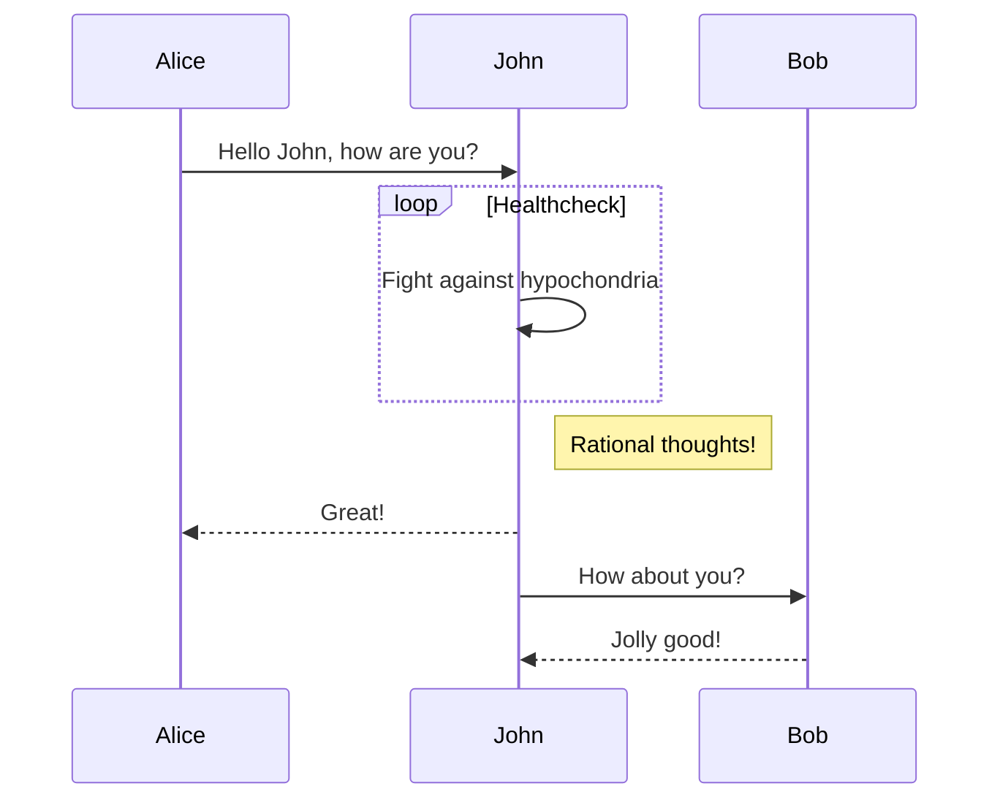

> 本文是使用`Markdown`编写的文档，使用`teedoc`生成的页面效果， `Markdown`文件源码见[这里](https://github.com/teedoc/teedoc.github.io/blob/main/docs/get_started/zh/syntax/syntax_markdown.md)

## Markdown 使用简介

放在文档目录下面的文件，如果是可是识别的文件，比如`*.md`， 则会转换成`*.html`， 如果不能识别，比如`*.jpg`， 则会原封不动地拷贝到输出文件夹（`out`）中。

默认 `Markdown` 解析由插件`teedoc-plugin-markdown-parser`完成， 模板工程默认使用了该插件。

如果你需要将文档链接到左侧目录， 则在`sidebar.json`或者`sidebar.yaml`中配置。

如果你使用过`Markdown`， 也强烈建议花 2 分钟浏览一遍！


## Markdown 基本文件内容格式

需要先在`site_config.json`中确认有`markdown`解析插件启用了，比如`teedoc-plugin-markdown-parser`。

在`config.json`对应的目录下建立文件夹或者文件， 比如`get_started/zh/syntax/syntax_markdown.md` (`README.md`最终会生成`index.html`)， 注意要使用`UTF-8`文件编码（不要使用`Windows`默认的记事本），推荐使用[vscode](https://code.visualstudio.com/) + `Markdown Preview Enhanced`插件, 默认文件就会是`UTF-8`编码，如果不是也可以在右下角点击编码并点击弹出的选项`通过编码保存`选择`UTF-8`即可更改编码。


### Markdown 元数据头

每个`md`文件可以添加一个头，也叫`metadata`（中文叫元数据），通过这些键值来设置文章信息，格式为`yaml`格式，当然这个文件头是可选的，也可以不写

```markdown
---
title: markdown 语法
tags: teedoc, markdown, 语法
keywords: teedoc, markdown, 语法
desc: teedoc 的 markdown 语法介绍和实例
id: zh_readme
class: zh_readme
# 以 # 号开头表示注释
---
```

* `title`: 文章的标题，如果没有元数据头的话，可以使用
```markdown
# 文章标题
```
或者
```markdown
文章标题
===
```

* `keywords`: 关键词，多个关键词用英文逗号`,` 隔开，会被添加到`html`头中，方便搜索引擎爬取，不会显示到页面。也可以用`yaml`列表的格式写
```markdown
keywords:
  - teedoc
  - markdown
  - 语法
```
* `desc`: 页面描述，会被添加到`html`头中，不会在页面显示，方便搜索引擎爬取
* `tags`： 文章标签，会显示到页面，多个标签用英文逗号`,` 隔开，也可以用`yaml`列表的格式写，同`keywords`
* `id`: 页面`id`， 会被添加到`html`标签中，比如`<html id="zh_readme">...</html>`, 通常不需要，一般在对某个页面单独自定义`css`的时候可能会用上，会覆盖`config.json`中的设置
* `class`: 页面`class`,多个用英文逗号`,`隔开，可以不设置，会覆盖`config.json`中的设置。比如可以通过设置这个值来达到设置特定页面的`css`样式。具体支持的样式见[主题插件的文档](../plugins/themes.md)
* `layout`: 页面使用的布局模板, 默认会使用主题插件里面的配置,如果你需要自定义此页面的布局, 可以设置这个参数, 路径相对于`site_config`中的`layout_root_dir`设置的路径, `layout_root_dir` 默认为`layout`, 所以要使用`layout/special_layout.html` 只需要填写`special_layout.html`. 布局模板语法见[layout 文档](../usage/layout_template.md)
* `date`: 最后更新日期，格式如`2022-09-15`
  * 如果不设置：默认会使用文件的最后修改时间，如果是`git`仓库，会自动从`git`获取页面最后一次提交的时间，如果没有`git`或者`git`获取失败则会从文件系统读取最后修改时间（这很可能不准确）。另外如果`update`填写了值，则会采用`update`中最新的修改日期
  * 如果不想显示最后修改日期，通过设置值为`false`来禁用
  * 如果设置了`update`值，仍然会优先使用`date`中的值
* `update`: 更新历史，会在文章开头生成更新历史表格，格式：
```markdown
update:
  - date: 2022-09-15
    author: author1
    version: 1.1.0
    content: 更新了xxx
  - date: 2022-08-05
    author: author2
    version: 1.0.0
    content: 更新了xxx
```
* `update_open`: 是否默认展开更新记录，默认为 `true`，关闭设置为`false`即可。（由主题插件支持）

### Markdown 文件内容

内容就是使用`Markdown`语法进行编写，因为大标题会被转成`<h1>`标签，所以内容中建议从二级标题开始，这样一个页面只有一个`<h1>`标签，方便搜索引擎爬取，比如

```markdown
---
title: teedoc
---

## 标题一

内容。。。

## 标题二

内容。。。
```

## 标题

### 三级标题

#### 四级标题

#### 四级标题2

#### 四级标题3

##### 五级标题

###### 六级标题

### 标题自定义id {#custom-id}
这里自定义 `id` 为 `custom-id`

最多 6 级标题

.. details::Markdown 源码，点击展开
    ```markdown
    ### 三级标题

    #### 四级标题

    #### 四级标题2

    #### 四级标题3

    ##### 五级标题

    ###### 六级标题

    ### 标题自定义id {#custom-id}
    这里自定义 `id` 为 `custom-id`
    ```

## 强调，斜体，删除线

我们只知道**地球**具有让人类生存的环境，还有~~火星~~，也许还有*其它星球*。

.. details::Markdown 源码，点击展开
    ```markdown
    我们只知道**地球**具有让人类生存的环境，还有~~火星~~，也许还有*其它星球*。
    ```

## 分隔符

分隔符
```markdown
---
***
```

---
***

## 链接

[相对路径， README.md 文件](../README.md): `../README.md`， 会自动转换成`index.html`
[相对路径， md 文件](./syntax_markdown.md)： `./syntax_markdown.md`， 会转成文档的 `.html` 结尾的链接
[绝对路径， http 文件](https://storage.googleapis.com/tensorflow_docs/docs-l10n/site/zh-cn/tutorials/quickstart/beginner.ipynb)： `https://。。。/beginner.ipynb`，原链接，不会修改
[相对路径， ipynb 文件](./syntax_jupyter.ipynb)： `./syntax_jupyter.ipynb`， 会转成文档的 `.html` 结尾的链接

.. details::Markdown 源码，点击展开
   ```markdown
   [相对路径， README.md 文件](../README.md)
   [相对路径， md 文件](./syntax_markdown.md)
   [绝对路径， http 文件](https://storage.googleapis.com/tensorflow_docs/docs-l10n/site/zh-cn/tutorials/quickstart/beginner.ipynb)
   [相对路径， ipynb 文件](./syntax_jupyter.ipynb)
   ```

## 列表

列表项:
* 包子
* 馒头
* 茶叶蛋

* aaaaaaa
  * 二级列表
  * 二级列表
  * 二级列表
    * 三级列表
    * 三级列表
* bbbbbb

.. details::Markdown 源码，点击展开
    ```markdown
    列表项:
    * 包子
    * 馒头
    * 茶叶蛋

    * aaaaaaa
      * 二级列表
      * 二级列表
      * 二级列表
        * 三级列表
        * 三级列表
    * bbbbbb
    ```

## 代码段

这是一段行内代码`print("hello")`，或者强调`teedoc`
```python
print("hello")

print("world")
```

```c
#include "stdio.h"

int main()
{
    printf("hello world");
}
```

.. details::Markdown 源码，点击展开
   ```markdown
        这是一段行内代码`print("hello")`，或者强调`teedoc`
        ```python
          print("hello")

          print("world")
        ```

        ```c
          #include "stdio.h"

          int main()
          {
              printf("hello world");
          }
        ```
   ```

## 注释(引用块)

下面是一段注释
> 这里是一段注释 (`<blockquote></blockquote>`)
> 这是注释的第二行
```python
# 这里是注释里面的代码段
print("hello")
```


> 注释
>> 注释嵌套
>> 注释嵌套

在块引用中使用 markdown 语法

> #### The quarterly results look great!
>
> - Revenue was off the chart.
> - Profits were higher than ever.
>
>  *Everything* is going according to **plan**.
> ```c
> printf("hello");
> ```

.. details::Markdown 源码，点击展开
   ```markdown
        下面是一段注释
        > 这里是一段注释 (`<blockquote></blockquote>`)
        > 这是注释的第二行
        ```python
        # 这里是注释里面的代码段
        print("hello")
        ```
        > 注释
        >> 注释嵌套
        >> 注释嵌套

        在块引用中使用 markdown 语法

        > #### The quarterly results look great!
        >
        > - Revenue was off the chart.
        > - Profits were higher than ever.
        >
        >  *Everything* is going according to **plan**.
        > ```c
        > printf("hello");
        > ```
   ```

## 警告

下面是一段警告信息

>! 这是一段警告信息(`<blockquote class="spoiler"></blockquote>`)

.. details::Markdown 源码，点击展开
    ```markdown
    >! 这是一段警告信息(`<blockquote class="spoiler"></blockquote>`)
    ```

## Emoji 表情

暂不支持`emoji`语法，但是可以直接从`emoji`表情大全拷贝表情到文档，比如:
🍊 🍇 😀 😅 😇

## 上下标

H~2~O， y = x^2^

.. details::Markdown 源码，点击展开
    ```markdown
    H~2~O， y = x^2^
    ```

## 图片

资源文件会被拷贝到输出文件夹（`out`）, 所以最重要的是怎么在文档中引用
* 最简单和推荐的方法
  使用相对路径：
  资源文件可以放在文档对应的目录，比如文档`docs/get_started/zh`， 可以创建`docs/get_started/zh/assets/images/logo.png`,
  然后在`docs/get_started/zh/README.md`中使用相对路径引用，即``
* 进阶方法
  这种情况适用于多份文档都引用同一个文件夹下（`url`）的资源， 方便维护多份文档，比如多语言翻译，或者减少 `CDN` 流量消耗。
  使用文档路径外的资源，在`site_config.json` 中配置
  ```json
  {
      "route": {
          "docs": {
              "/get_started/zh/": "docs/get_started/zh",
          },
          "assets": {
              "/get_started/assets/": "docs/get_started/assets"
          }
      }
  }
  ```
  这个设置会将`docs/get_started/assets`整个目录拷贝为`/get_started/assets`
  所以只需要在`docs/get_started/zh/README.md`中使用相对路径引用，即``


要显示这张图片，需要在`site_config.json`中设置`route`键值


.. details::Markdown 源码，点击展开
    ```markdown
    
    

    
    ```

## 视频

直接使用 HTML 的 `video` 标签：

```html
<video src="https://****.com/***.mp4" controls="controls" preload="auto">your brower not support play video</video>
```

这里没有放视频， 所以是空白, 放入正确的视频就可以播放了

<video src="" controls="controls" preload="auto">your brower or site not support play video</video>


## iframe 嵌入网页

一般视频平台分享的代码直接能使用，可以稍微设置一下宽高

<iframe src="//player.bilibili.com/player.html?aid=52613549&bvid=BV144411J72P&cid=92076022&page=1" scrolling="no" border="0" frameborder="no" framespacing="0" allowfullscreen="true" style="width:43vw;height:34vw;min-width: 85%;"> </iframe>

.. details::Markdown 源码，点击展开
    ```html
    <iframe src="//player.bilibili.com/player.html?aid=52613549&bvid=BV144411J72P&cid=92076022&page=1" scrolling="no" border="0" frameborder="no" framespacing="0" allowfullscreen="true" style="width:43vw;height:34vw;min-width: 85%;"> </iframe>
    ```

## 引用标记

我能干饭我自豪。[^干饭人]

[^干饭人]: 老子说道
这会在文章末尾进行注解

.. details::Markdown 源码，点击展开
    ```markdown
    我能干饭我自豪。[^干饭人]

    [^干饭人]: 老子说道
    这会在文章末尾进行注解
    ```

## 表格

| Header 1 | *Header* 2 |
| -------- | -------- |
| `Cell 1` | [Cell 2](http://example.com) link |
| Cell 3 | **Cell 4** |

.. details::Markdown 源码，点击展开
    ```markdown
    | Header 1 | *Header* 2 |
    | -------- | -------- |
    | `Cell 1` | [Cell 2](http://example.com) link |
    | Cell 3 | **Cell 4** |
    ```

## 任务列表

- [x] 任务1
- [x] 任务2
- [ ] 任务3
- [ ] 任务4

.. details::Markdown 源码，点击展开
    ```markdown
    - [x] 任务1
    - [x] 任务2
    - [ ] 任务3
    - [ ] 任务4
    ```

## 标题链接(页内跳转)


比如要跳转到标题[iframe 嵌入网页](#iframe-嵌入网页), 只需
```markdown
[iframe 嵌入网页](#iframe-嵌入网页)
```

这里空格使用了减号`-`替换。
另外，如果标题也可以自定义`id`，比如
```markdown
## iframe 嵌入网页 {#iframe-embed}
```


## HTML

能直接在`md`文件中写`HTML`：

<div class="hello">
hello <br/> 
</div>

.. details::Markdown 源码，点击展开
   注意没有空行
   ```html
   <div class="hello">
   hello  
   </div>
   ```


## 数学

支持`tex`和`Latex`语法，以及`MathML`标签

两种写法，
* 一种是行内内嵌，用`$`符号将方程包起来，比如

质能方程 $E=mc^2$大家很熟悉吧

.. details::Markdown 源码，点击展开
    ```markdown
    质能方程 $E=mc^2$大家很熟悉吧
    ```

* 另一种，块方程，用`$$`将方程包起来，比如

$$
E=mc^2
$$

.. details::Markdown 源码，点击展开
    ```markdown
    $$
    E=mc^2
    $$
    ```

其他例子：
常见：

When $a \ne 0$, there are two solutions to $ax^2 + bx + c = 0$ and they are
$$
x = {-b \pm \sqrt{b^2-4ac} \over 2a}.
$$

.. details::Markdown 源码，点击展开
    ```markdown
    When $a \ne 0$, there are two solutions to $ax^2 + bx + c = 0$ and they are
    $$
    x = {-b \pm \sqrt{b^2-4ac} \over 2a}.
    $$
    ```

除法式：

$$
\require{enclose}
\begin{array}{r}
                13  \\[-3pt]
4 \enclose{longdiv}{52} \\[-3pt]
     \underline{4}\phantom{2} \\[-3pt]
                12  \\[-3pt]
     \underline{12}\\0
\end{array}\\
$$

.. details::Markdown 源码，点击展开
    ```markdown
    $$
    \require{enclose}
    \begin{array}{r}
                    13  \\[-3pt]
    4 \enclose{longdiv}{52} \\[-3pt]
        \underline{4}\phantom{2} \\[-3pt]
                    12  \\[-3pt]
        \underline{12}\\0
    \end{array}\\
    $$
    ```

加框：

$$
\bbox[#cde, 3px,border:1px solid blue]{y=x^2-1}
$$

.. details::Markdown 源码，点击展开
    ```markdown
    $$
    \bbox[#cde, 3px,border:1px solid blue]{y=x^2-1}
    $$
    ```

## mermaid 支持

使用 mermaid 可以画很多类型的图表， 详细的语法和支持请看[官网](https://mermaid-js.github.io/)



.. details::Markdown 源码，点击展开
    ```markdown
        ```mermaid
        sequenceDiagram
          Alice->>John: Hello John, how are you?
          loop Healthcheck
              John->>John: Fight against hypochondria
          end
          Note right of John: Rational thoughts!
          John-->>Alice: Great!
          John->>Bob: How about you?
          Bob-->>John: Jolly good!
        ```
    ```
    或者直接 `html`:
      ```html
      <div class="mermaid">
      sequenceDiagram
        Alice->>John: Hello John, how are you?
        loop Healthcheck
            John->>John: Fight against hypochondria
        end
        Note right of John: Rational thoughts!
        John-->>Alice: Great!
        John->>Bob: How about you?
        Bob-->>John: Jolly good!
      </div>
    ```

## 标签页（tabset）支持

> 因为不是标准 Markdown 语法，目前仅 teedoc 支持，所以根据你的需求选择使用
> 当然也欢迎将格式推广到其它解析器

效果：

.. tabset::标签页标题（可选）
    :id: tabset1

    ## 标签一

    内容一，可以使用 Markdown 语法
    ```kotlin
      fun main() {
          println("Hello World")
      }
    ```

    ## 标签二

    内容二，可以使用 Markdown 语法
    ```java
      public class Main {
          public static void main(String[] args) {
              System.out.println("Hello World");
          }
      }
    ```

在选中一个页面中的某个标签时，会自动选中相同`id`的标签页中的相应标签，不相同`id`或者没设置`id`则不会。

.. tabset::
    :id: tabset1

    ## 标签一

    内容一，可以使用 Markdown 语法
    ```kotlin
      fun main() {
          println("Hello World")
      }
    ```

    ## 标签二

    内容二，可以使用 Markdown 语法
    ```java
      public class Main {
          public static void main(String[] args) {
              System.out.println("Hello World");
          }
      }
    ```

.. tabset::

    ## 标签一

    内容一，可以使用 Markdown 语法
    ```kotlin
      fun main() {
          println("Hello World")
      }
    ```

    ## 标签二

    内容二，可以使用 Markdown 语法
    ```java
      public class Main {
          public static void main(String[] args) {
              System.out.println("Hello World");
          }
      }
    ```

.. details::Markdown 源码，点击展开
    ```markdown
    效果：
    （注意这里需要空一行）
    .. tabset::标签页标题（可选）
        :id: tabset1
        (注意必须和上面的 tabset 对齐或者更多空格)
        ## 标签一

        内容一，可以使用 Markdown 语法
        ```kotlin
          fun main() {
              println("Hello World")
          }
        ```

        ## 标签二

        内容二，可以使用 Markdown 语法
        ```java
          public class Main {
              public static void main(String[] args) {
                  System.out.println("Hello World");
              }
          }
        ```
    ```

## 详情页（details）支持

> 因为不是标准 Markdown 语法，目前仅 teedoc 支持，所以根据你的需求选择使用
> 当然也欢迎将格式推广到其它解析器

这是对 `HTML5` `details`标签的一种 `Markdown` 语法， `HTML`这样写:
```html
<details>
  <summary>标题，点击展开</summary>
  <div class="details-content">
    <p>这里是内容</p>
  </div>
</details>
```

效果：

.. details::标题，点击展开

    内容一，可以使用 Markdown 语法
    ```kotlin
      fun main() {
          println("Hello World")
      }
    ```

.. details::标题，默认展开
    :open: true

    内容一，可以使用 Markdown 语法
    ```kotlin
      fun main() {
          println("Hello World")
      }
    ```

.. details::Markdown 源码，点击展开
    ```markdown
    .. details::标题，点击展开

        内容一，可以使用 Markdown 语法
        ```kotlin
          fun main() {
              println("Hello World")
          }
        ```

    .. details::标题，默认展开
        :open: true

        内容一，可以使用 Markdown 语法
        ```kotlin
          fun main() {
              println("Hello World")
          }
        ```
    ```

